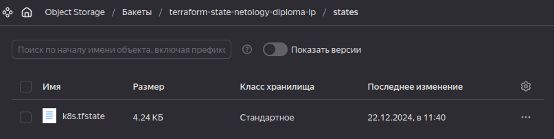

# Дипломная работа по направлению "DevOps-инженер с нуля"

* [ТЗ](<Terms of reference.md>)

## Все составляющие итоговой системы

* Модули terraform:
    * [simple-vpc](https://github.com/RedRatInTheHat/simple-vpc)
    * [simple-vms](https://github.com/RedRatInTheHat/simple-vms)
* Bucket для tfstate:
    * [terraform-bucket](https://github.com/RedRatInTheHat/terraform-backend)
* Инфраструктура для kubernetes:
    * [terraform-for-k8s](https://github.com/RedRatInTheHat/terraform-for-k8s)

## Решение

1. Для работы с инфраструктурой ранее создавался сервисный аккаунт `terraform`. Ему предоставлены некоторые доступы для создания ресурсов в отдельной папке diploma. `#TODO: приложить скриншот итоговых доступов.`

2. Добавлено создание S3 bucket'а с помощью Terraform; код содержится [отдельном репозитории](https://github.com/RedRatInTheHat/terraform-backend).

3. В проект для создания инфраструктуры в Terraform подлкючен функционал сохранения файла состояний в S3 bucket'е: [main.tf](https://github.com/RedRatInTheHat/terraform-for-k8s/blob/master/main.tf)

4. Файл состояний успешно сохраняется в bucket'е:

5. Для создания сети использован ранее написанный модуль [simple-vpc](https://github.com/RedRatInTheHat/simple-vpc). Подключение модуля: [vpc.tf](https://github.com/RedRatInTheHat/terraform-for-k8s/blob/master/vpc.tf).

6. Для создания виртуальных машин использован ранее написанный модуль [simple-vms](https://github.com/RedRatInTheHat/simple-vms). Подключение модуля: [vms.tf](https://github.com/RedRatInTheHat/terraform-for-k8s/blob/master/vms.tf). 
Можно было бы создать группу машин, но нам не нужны фишки масштабирования, так что как будто нет особой разницы.

