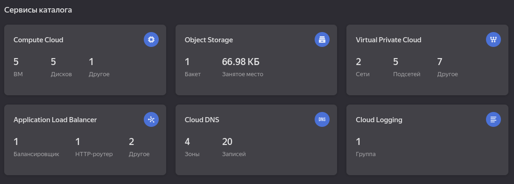

# Дипломная работа по направлению "DevOps-инженер с нуля"

* [ТЗ](<Terms of reference.md>)

## Все созданные составляющие итоговой системы

* Модули terraform:
    * [simple-vpc](https://github.com/RedRatInTheHat/simple-vpc)
    * [simple-vms](https://github.com/RedRatInTheHat/simple-vms)
    * [simple-vmg](https://github.com/RedRatInTheHat/simple-vmg)
    * [simple-ab](https://github.com/RedRatInTheHat/simple-ab)
* Bucket для tfstate:
    * [terraform-bucket](https://github.com/RedRatInTheHat/terraform-backend)
* Инфраструктура для kubernetes:
    * [terraform-for-k8s](https://github.com/RedRatInTheHat/terraform-for-k8s)

## Решение

### Terraform

#### Backend

Для работы с инфраструктурой ранее создавался сервисный аккаунт `terraform`. Ему предоставлены некоторые доступы для создания ресурсов в отдельной папке diploma. `#TODO: приложить скриншот итоговых доступов.`

Добавлено создание S3 bucket'а с помощью Terraform; код содержится [отдельном репозитории](https://github.com/RedRatInTheHat/terraform-backend).

В проект для создания инфраструктуры в Terraform подлкючен функционал сохранения файла состояний в S3 bucket'е: [main.tf](https://github.com/RedRatInTheHat/terraform-for-k8s/blob/master/main.tf)

Файл состояний успешно сохраняется в bucket'е:

#### Инфраструктура для K8S

* Для создания сети использован ранее написанный модуль [simple-vpc](https://github.com/RedRatInTheHat/simple-vpc). Подключение модуля: [vpc.tf](https://github.com/RedRatInTheHat/terraform-for-k8s/blob/master/vpc.tf).
* Для создания bastion host и master node использован ранее написанный модуль [simple-vms](https://github.com/RedRatInTheHat/simple-vms). Подключение модуля: [vms.tf](https://github.com/RedRatInTheHat/terraform-for-k8s/blob/master/vms.tf). 
* Для создания worker node использован модуль [simple-vmg](https://github.com/RedRatInTheHat/simple-vmg), который создаёт группу инстансов. Модуль подключается там же, в vms.tf.
* Для обеспечения доступа к созданным машинам, создан Application Load Balancer. Его создание вынесено в модуль [simple-ab](https://github.com/RedRatInTheHat/simple-ab), а сам модуль подключается в [application-load-balancer.tf](https://github.com/RedRatInTheHat/terraform-for-k8s/blob/master/application-load-balancer.tf)

Как это в итоге работает:
1. Создаются master-ноды (отдельные виртуальные машины) и worker-ноды в составе группы виртуальных машин в заданном количестве. 
У них нет публичных адресов, только внутренние. 
Для обеспечения отказоустойчивости master тоже стоило бы создавать в составе группы, но они созаются дольше и обрастают неожиданными ошибками (*нет, я не могу удалить публичный адрес у одной единственной машины, а теперь я не могу удалить машины вообще*), так что в составе ученической работы был оставлен такой вариант.

2. ip адреса машин записываются в файл inventory, который позднее используется при настройке k8s с помощью kubespray.

3. Для доступа к виртуальным машинам для Ansible используется ProxyJump в файле `.ssh/config`, а для доступа пользователей к приложению, поднятому в k8s, настроен load balancer. 
Для работы с удалённым master-узлом используется SSH-туннелирование. 
Доступ пользователей к приложениям производится через публичный адрес роутера, а для health check настроено добавление название host'а в header'e.

4. Группы безопасности не настроены, а зря.

#TODO настроить группы безопасности
#TODO настроить скриншоты для отображения того, что всё ок и поднялось.

### Ansible

#### Kubespray

С помощью Kubespray производится установка k8s на ноды, созданные Terraform. Как уже упоминалось, доступ к нодам производится с помощью ProxyJump.

В файлах kubespray внесены следующие изменения:
* файл `inventory/cluster/inventory.yaml` создаётся автоматически после создания виртуальных машин.
* в файле `inventory/cluster/group_vars/k8s_cluster/addons.yml` подключен Nginx Ingress Controller (Раздел `# Nginx ingress controller deployment`).

